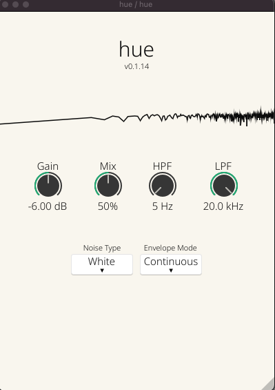

# Hue


## Overview

Hue is an audio plugin that helps mix different noise types into an audio signal.

## Features

- **4 Noise Types**: White, pink, brownian, and violet noise are supported at the moment.

- **2 Envelope Options**: In follow mode, an envelope follower is used to apply the incoming audio signal's amplitude to the noise signal. Continuous mode will continuously play the noise signal. This mode can make the plugin a nice replacement for a sound machine :smile:.

- **Mix and Gain Options**: The mix and gain options allow you to control how much noise is blended in with your audio signal.
    - 0% mix will playback only the input audio signal. 100% will only playback the noise signal.
    - Gain can be used to increase the amplitude of the noise once a mix level has been set.
  
- **Filtering**: Basic lowpass and highpass filters are provided to filter the noise frequencies only, allowing you to mix in only parts of a noise algorithm into your signal.

## Installation

1. Download the latest release for your OS from the following [nightly link page](https://nightly.link/bljustice/hue/workflows/build/main).
2. Extract the downloaded archive to your VST3 plugin folder.

## Building from Source

If you want to build the plugin from source, follow these steps:

1. Clone the repository:

```bash
git clone https://github.com/bljustice/hue.git
```
2. Run the following script within the repo, which will create the vst3 version fo the plugin.
```bash
./build_vst3.sh -r
```
